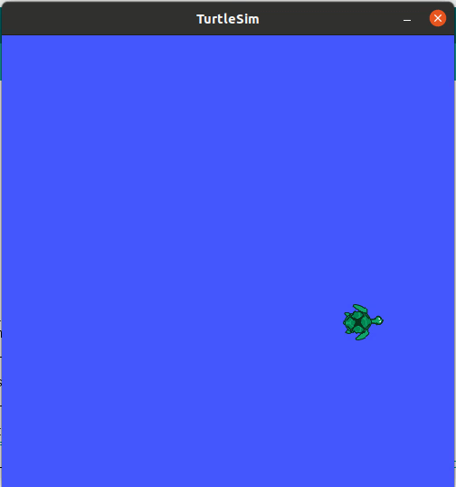
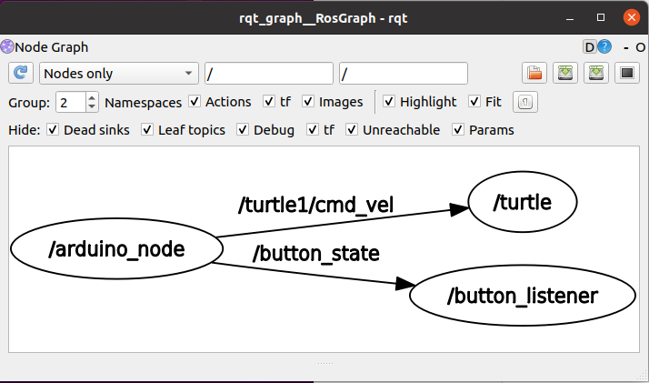

# Arduino with turtlesim

Control movement and orientation of turtlesim using a joystick module connected to an arduino board.



The turtle can go forward and backward, turn right and left, the screen is cleared by clicking the joystick.


## Dependencies
* Python >= 3.8.10
* [ROS noetic](http://wiki.ros.org/noetic)
* [rosserial_arduino](http://wiki.ros.org/rosserial_arduino/Tutorials/Arduino%20IDE%20Setup)
* [Arduino IDE](https://www.arduino.cc/en/software) >= 1.8.19

## Basic execution
1. Clone this repository
2. Open the terminal in the arduino_turtlesim directory: `cd your-own-path/arduino_turtlesim`
3. Build the ros packages: `catkin_make`
4. Source project: `source devel/setup.bash`
5. Launch the nodes: `roslaunch turtlesim_control start_turtle_control.launch`

Nodes and topics are communicated as following:



## Project structure

After building the project you'll have the following folders and files:

```
arduino_turtelsim
├── README.md       # This file.
├── media           # Images
├── build
├── devel
└── src
    └── turtlesim_control
        ├── arduino
            ├── hello_message
            ├── joystick_message
            └── joystick_test
        ├── launch
            ├── hello.launch
            ├── start_turtle_control.launch
            └── test_turtle_control_launch
        └── scripts
            ├── button_subscriber.py
            └── serial_subscriber.py
```

Let's take a closer look at the purpose of each of these folders and files:

* `hello_message`: Arduino program to send a simple message "Hello world from arduino-ros" through serial port.
* `joystick_message`: Arduino program to read joystick state and send cmd_vel message for turtlesim.
* `joystick_test`: Arduino program to read and display joystick values through monitor serial.
* `hello.launch`: Launch file for starting rosserial node and `serial_subscriber.py` node. This file is used for testing communication between arduino and ros.
* `test_turtle_control.launch`: Launch file for starting rosserial node and turtlesim node. Also remap cmd_vel message from arduino.
* `start_turtle_control.launch`: Main launch file for starting all nodes: rosserial, turtlesim and button_listener node.
* `button_subscriber.py`: A node that listen the button state from the joystick. If the button is pressed calls 'clear' service from turtlesim.
* `serial_subscriber.py`: A node for testing messages send from arduino under 'chatter' topic.
